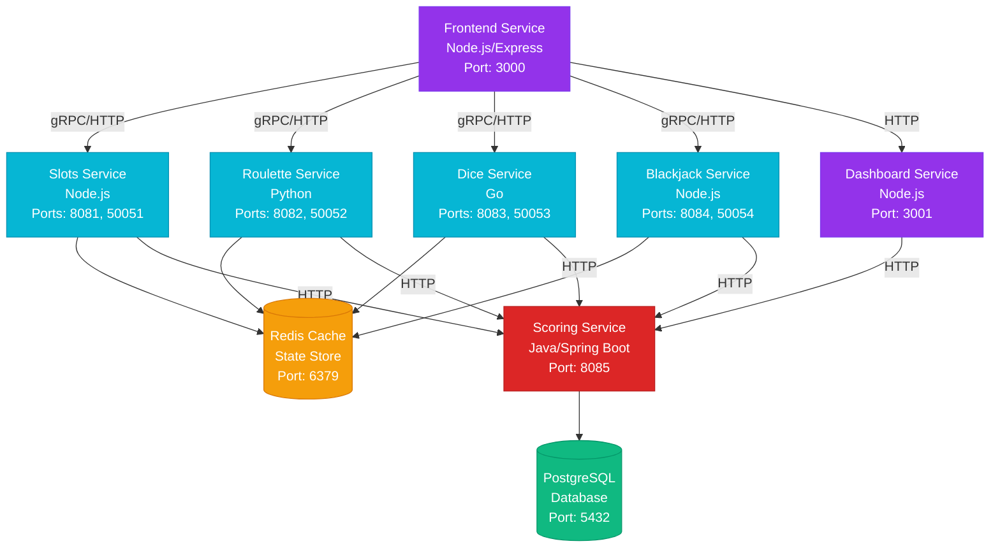
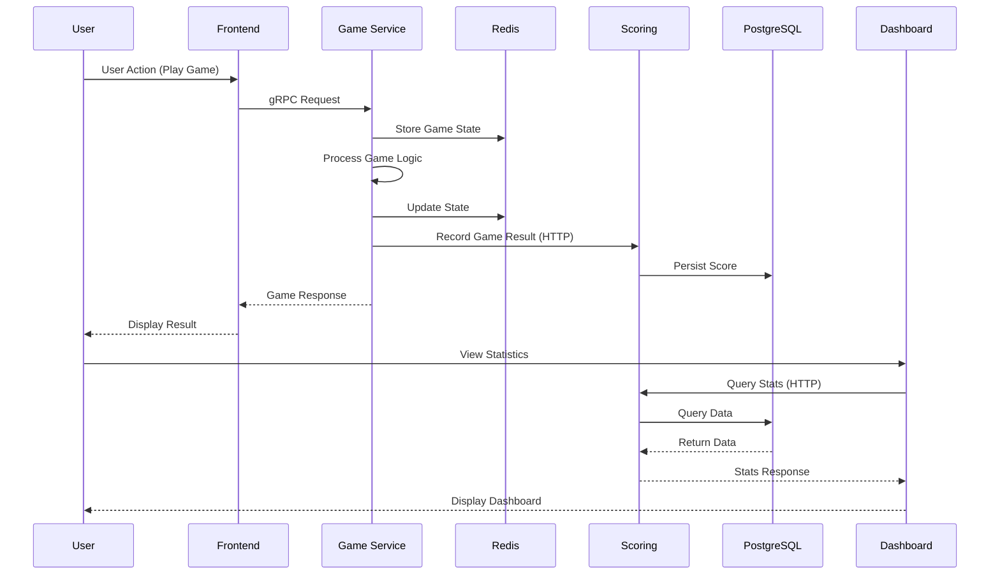
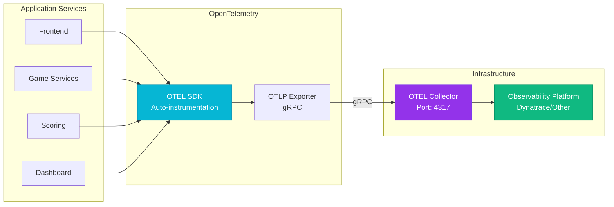
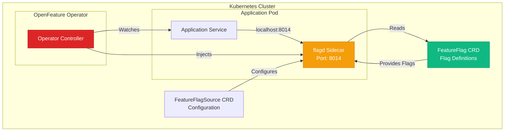

# Architecture Overview

## System Architecture

Vegas Casino follows a **microservices architecture** with multiple independent services communicating via HTTP and gRPC protocols.

## Service Communication

### HTTP Communication
- Frontend ↔ Game Services (fallback)
- Frontend ↔ Dashboard Service
- Dashboard ↔ Scoring Service
- Game Services ↔ Scoring Service

### gRPC Communication
- Frontend ↔ Game Services (primary)
- All services use gRPC for better performance and type safety

## Data Flow

## Observability Stack

- **OpenTelemetry**: Distributed tracing and metrics
- **OpenTelemetry Collector**: Receives and exports telemetry data
- **gRPC Exporter**: Sends traces to collector on port 4317
- **Trace Context Propagation**: W3C Trace Context across all services

## Feature Flag Management

- **OpenFeature Operator**: Manages flagd sidecar injection
- **flagd**: Feature flag evaluation service (sidecar)
- **FeatureFlagSource**: Kubernetes CRD for flag configuration
- **FeatureFlag**: Kubernetes CRD for flag definitions

---

**Next**: Learn about [Components](components.md) or the [Technology Stack](technology.md).

