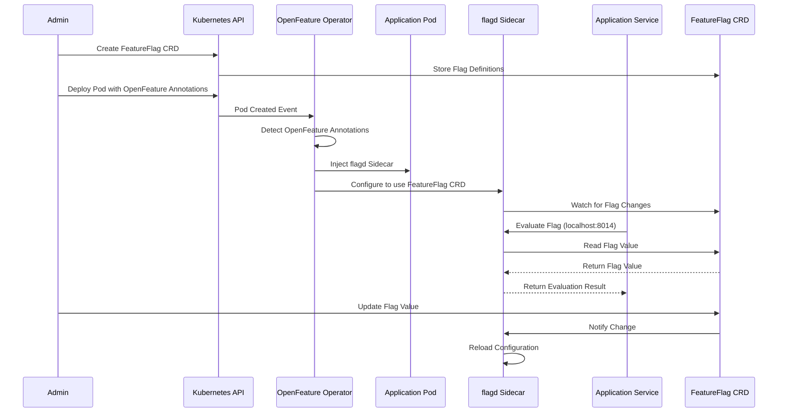

# OpenFeature Operator

## ⚠️ CRITICAL: Install Before Application

The **OpenFeature Operator must be installed BEFORE deploying the Vegas Casino application**. The operator manages the flagd sidecar injection and FeatureFlag CRDs.

## Why OpenFeature Operator?

The OpenFeature Operator provides:

- ✅ **Automatic flagd sidecar injection** - No manual configuration needed
- ✅ **Kubernetes-native feature flags** - CRDs for flag management
- ✅ **Centralized configuration** - Manage flags via Kubernetes resources
- ✅ **Dynamic updates** - Change flags without redeploying services

## Installation

### Step 1: Add Helm Repository

```bash
helm repo add openfeature https://open-feature.github.io/open-feature-operator
helm repo update
```

### Step 2: Install Operator

```bash
helm install open-feature-operator openfeature/open-feature-operator \
  --namespace open-feature-system \
  --create-namespace \
  --wait
```

### Step 3: Verify Installation

```bash
# Check operator pod
kubectl get pods -n open-feature-system

# Verify CRDs are installed
kubectl get crd | grep openfeature

# Should see:
# - featureflags.core.openfeature.dev
# - featureflagsources.core.openfeature.dev
```

## Operator Components

### FeatureFlag CRD

Defines feature flag configurations:

```yaml
apiVersion: core.openfeature.dev/v1beta1
kind: FeatureFlag
metadata:
  name: vegas-casino-flags
spec:
  flagSpec:
    flags:
      "slots.progressive-jackpot":
        state: ENABLED
        defaultVariant: "true"
        variants:
          "true": true
          "false": false
```

### FeatureFlagSource CRD

Links flagd sidecar to flag definitions:

```yaml
apiVersion: core.openfeature.dev/v1beta1
kind: FeatureFlagSource
metadata:
  name: vegas-casino-flag-source
spec:
  sources:
    - source: vegas-casino/vegas-casino-flags
      provider: kubernetes
  port: 8014
  managementPort: 8015
```

## How It Works



1. **Operator watches** for pods with OpenFeature annotations
2. **Injects flagd sidecar** automatically
3. **Configures flagd** to connect to FeatureFlag resources
4. **Services connect** to flagd via `localhost:8014`

## Pod Annotations

Services need these annotations for sidecar injection:

```yaml
annotations:
  openfeature.dev/enabled: "true"
  openfeature.dev/featureflagsource: "vegas-casino/vegas-casino-flag-source"
```

## Troubleshooting

### Operator Not Running

```bash
# Check operator status
kubectl get pods -n open-feature-system

# Check operator logs
kubectl logs -n open-feature-system \
  -l control-plane=controller-manager
```

### Sidecar Not Injected

```bash
# Check pod annotations
kubectl describe pod <pod-name> -n vegas-casino

# Verify FeatureFlagSource exists
kubectl get featureflagsource -n vegas-casino

# Check flagd sidecar
kubectl get pod <pod-name> -n vegas-casino -o jsonpath='{.spec.containers[*].name}'
# Should include 'flagd'
```

### Flags Not Loading

```bash
# Check FeatureFlag resource
kubectl get featureflag -n vegas-casino
kubectl describe featureflag vegas-casino-flags -n vegas-casino

# Check flagd logs
kubectl logs <pod-name> -c flagd -n vegas-casino
```

### Port Conflicts

If you see port conflicts:

```yaml
# In FeatureFlagSource, ensure ports are different
spec:
  port: 8014        # gRPC port
  managementPort: 8015  # Management port (must be different)
```

## Updating Flags

### Update FeatureFlag

```bash
# Edit FeatureFlag
kubectl edit featureflag vegas-casino-flags -n vegas-casino

# Or apply new version
kubectl apply -f helm/vegas-casino/templates/featureflag.yaml
```

### Verify Flag Updates

```bash
# Check flagd logs for reload
kubectl logs <pod-name> -c flagd -n vegas-casino | grep "flag updated"
```

## Uninstalling

**⚠️ WARNING**: Uninstalling the operator will break feature flags!

```bash
# Uninstall operator
helm uninstall open-feature-operator -n open-feature-system

# Note: This will NOT remove CRDs
# To remove CRDs:
kubectl delete crd featureflags.core.openfeature.dev
kubectl delete crd featureflagsources.core.openfeature.dev
```

## Best Practices

1. **Install First**: Always install operator before application
2. **Namespace**: Use dedicated namespace for operator
3. **Version Pinning**: Pin operator version for stability
4. **Resource Limits**: Set appropriate limits for operator
5. **Monitoring**: Monitor operator health and flagd sidecars

## Additional Resources

- [OpenFeature Operator Documentation](https://openfeature.dev/docs/reference/operator/)
- [flagd Documentation](https://flagd.dev/)
- [Feature Flag Best Practices](https://openfeature.dev/docs/concepts/flag-management/)

---

**Next**: Return to [Deployment Overview](index.md) or [Helm Deployment](helm.md).

