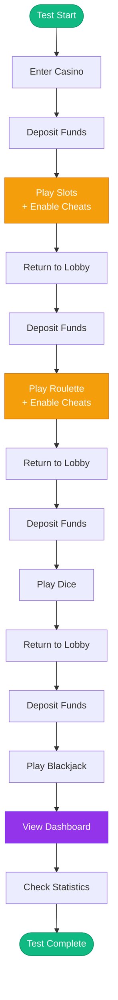

# Testing Overview

The Vegas Casino project includes two types of automated testing:

1. **Playwright** - End-to-end browser automation
2. **k6** - Load and performance testing

Both testing tools are containerized and can be deployed as Kubernetes Jobs or run locally.

## Testing Strategy

### Playwright Tests
- **Purpose**: Simulate real user journeys
- **Scope**: Full application flow from entry to dashboard
- **Execution**: Continuous or one-time runs
- **Output**: Console logs and traces

### k6 Load Tests
- **Purpose**: Performance and scalability testing
- **Scope**: API endpoints under load
- **Execution**: Configurable duration and virtual users
- **Output**: Performance metrics and statistics

## Test Coverage



Both test suites cover:

- ✅ User registration and entry
- ✅ Game selection and play
- ✅ Feature flag activation
- ✅ Deposit functionality
- ✅ Dashboard viewing

## Running Tests

### Playwright
```bash
# Via Helm (as Job)
helm upgrade --install vegas-casino ./helm/vegas-casino \
  --set playwright.enabled=true

# Or manually
kubectl apply -f helm/vegas-casino/templates/playwright-deployment.yaml
```

### k6
```bash
# Via Helm (as Job)
helm upgrade --install vegas-casino ./helm/vegas-casino \
  --set k6.enabled=true

# Or manually
kubectl apply -f helm/vegas-casino/templates/k6-deployment.yaml
```

---

**Next**: Learn about [Playwright Tests](playwright.md) or [k6 Load Tests](k6.md).

